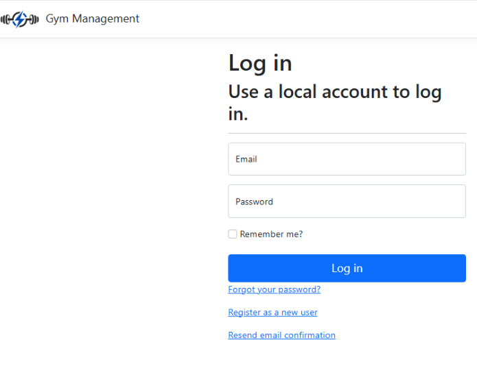
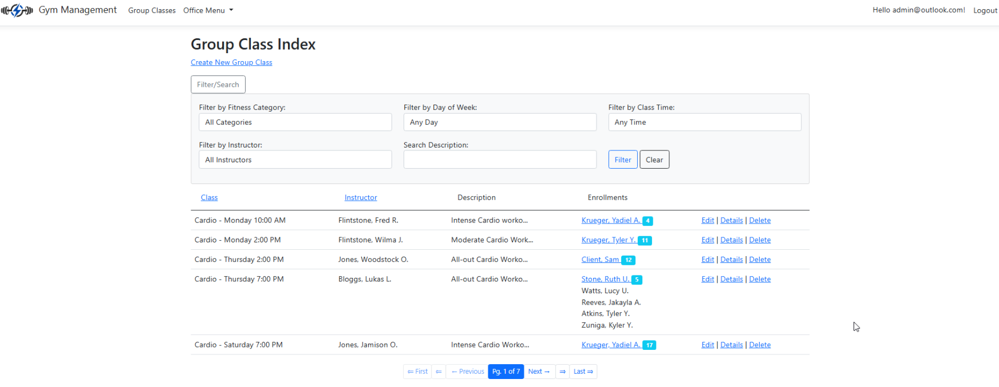
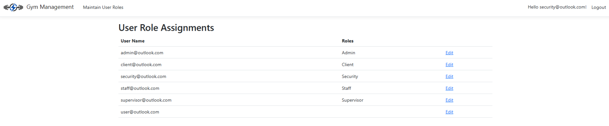
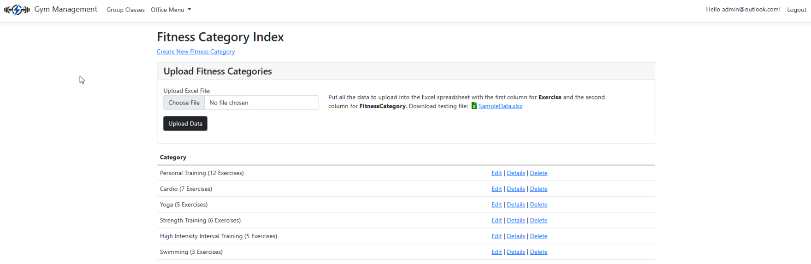

# Gym Management System

A full-stack web application for managing gym operations — members, instructors,
workout schedules, and documents — built with ASP.NET Core MVC and SQLite.

## What it does

- Member and instructor management with search and filtering
- Role-based access control (Admin, Supervisor, Staff, Client) using ASP.NET Identity
- Workout scheduling — instructors can assign routines to members
- Document uploads and management
- Automated Excel report generation for admins
- Responsive UI that works on desktop and mobile

## Screenshots

<p align="left">
  
    
</p>

<p align="left">
      
    
</p>

**Main page**


## Tech stack

- Backend: C#, ASP.NET Core MVC, Entity Framework Core
- Database: SQLite
- Auth: ASP.NET Identity (role-based access control)
- Frontend: HTML5, CSS3, JavaScript, Bootstrap

## Getting started

Prerequisites: .NET SDK 8.0+, Visual Studio 2022 or VS Code

```bash
git clone https://github.com/Crashjoy/Gym-Management-Project
cd Gym-Management-Project
dotnet restore
dotnet ef database update   # creates the SQLite database and seed data
dotnet run
